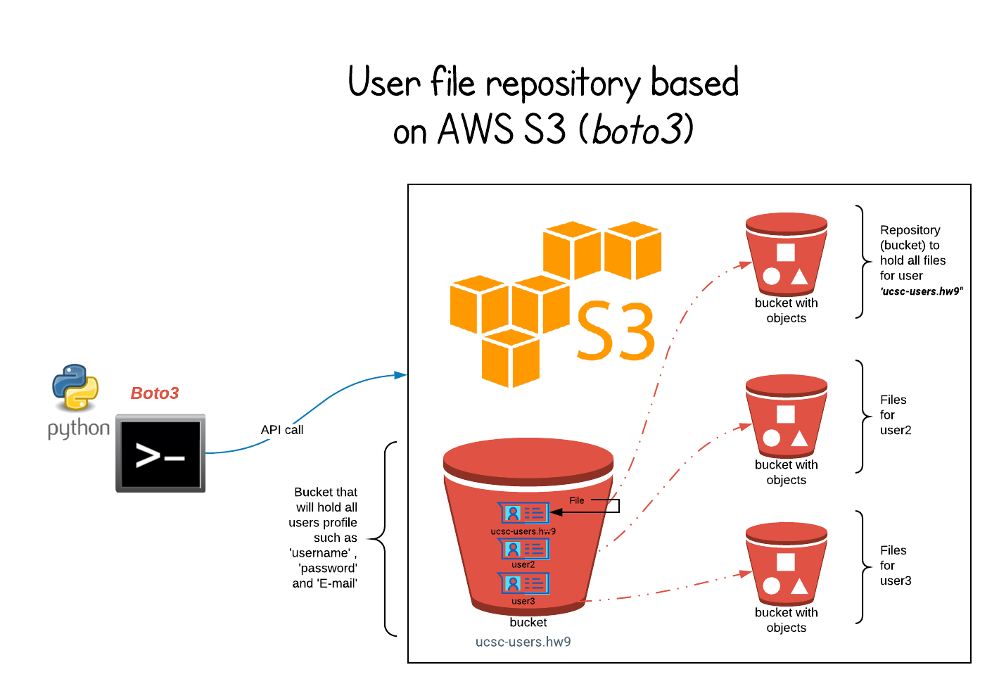
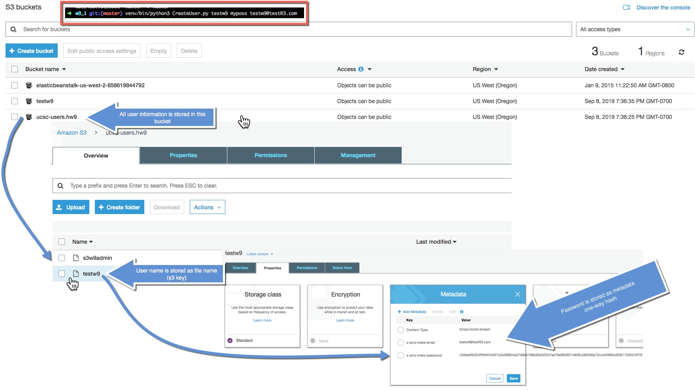

# Introduction 

Using Python and Boto3 this project demonstrates how with set of Python  
scripts we can manage a simple S3 storage repository that stores and manages files on a per-user basis.

## Main highlights 

- Create user : using CreateUser.py user can create a S3 Repo user
- Upload file : Once user has been created in repo - user can use UploadFile.py to upload file to S3 Repo
- List file(s): Using ListFiles.py user can list all the files they have uploaded ( if any file present in Repo )
- Get file: Using GetFile.py we can download the file 
- Delete file : Using DeleteFile.py we can delete file from user repo 

---

- On fist user creation - User repo (bucket:ucsc-users.hw9) gets initialized (user bucket/Repo that will stored all user information)
- Passwords are stored using [one-way sah256 hash](https://www.pythoncentral.io/hashing-strings-with-python/) in S3 Repo as metadata of file in users bucket 'ucsc-users.hw9' 
- During file upload we also show upload progress to see how much file has been uploaded to track long uploads 
- List file uses Python library [pretty table](http://zetcode.com/python/prettytable/) to print data in tabular format 

---

- There is unit test file tests3repo.py that does Unit test on each of the major functions needed for this project 
- Using file tear_down.py we can cleanup all users and their files ( admin password is required for this - admin password is stored in s3repomain.py file )

# Schematic 

# Files 

As this repo has many files lets go over each of them in brief 

| File | Description |
| ---- | --- |
| ├── CreateUser.py | Command line program to create S3 repo user, same can be used to update user info  |
| ├── ListFiles.py | Same as above but to list users file stored in S3 (authentication required) |
| ├── UploadFile.py | Program to upload file to S3 Repo (authentication required)  |
| ├── __init__.py |  |
| ├── tear_down.py | Program to destroy all Repo(s) - (Admin authentication required) |
| └── tests3repo.py | Python Unite test to all functionality of this project |
| ├── README.md | Git readme (this file) |
| ├── input | Directory with sample input file |
| │   ├── test.txt | Sample input file |
| │   └── test2.txt | Sample input file |
| ├── output | Download will save files in this dire |
| │   └── test.txt | Sample output file downloaded |
| ├── s3repo | Main code folder |
| │   ├── helper | Code sub folder with helper file(s) |
| │   │   ├── ProgressPercentage.py | Python code to print file download progress |
| │   │   ├── __init__.py |  |
| │   │   ├── awsGetConnection.py | Code to get AWS connection ; get Boto3 session |
| │   │   ├── logger_setup.py | Python logger setup (file and console) |
| │   │   ├── password_helper.py | Code to create one-way hash for password (use to save and compare password )  |
| │   ├── logs | Logs will be save in this folder  |
| │   │   └── s3repo.log | Log file |
| │   ├── __init__.py |  |
| │   └── s3repomain.py | Main code that has functions such as for : crate S3 Repo,create user,authentication user,upload file,download file,delete user & repo,tear down all |

# Demo 

## Create a user 

This demo show how user gets created and how it's information is stored in S3 

Below image shows - we have one common bucket "" that stores all user information and inside that bucket there is file that stores user information  
User name is stored in file name itself and password and E-mail is stored as metadata  
Password is stored as one-way sha256 hash 

## Upload file 

This demo shows local file getting uploaded to S3 Repo 

## List file 

This demo shows file uploaded before now getting listed as users file  
It also list the user-key/tag that user provided during upload 

## Get file 

This demo show how we can download file via providing user-key / tag that  
we used during upload 

## Delete file 

This demo show how we can delete file via providing user-key / tag that  
we used during upload 

---

## Unite test 

This demo shows Unit test running all test(s) that makes sure all functions that are needed for this project to run are working as expected 
All tests are idempotent - they create stuff that is needed for test and then clean it up 

## Tear down 

This demo show tear down in action - we use this to cleanup everything when we don't need S3 Repo 

