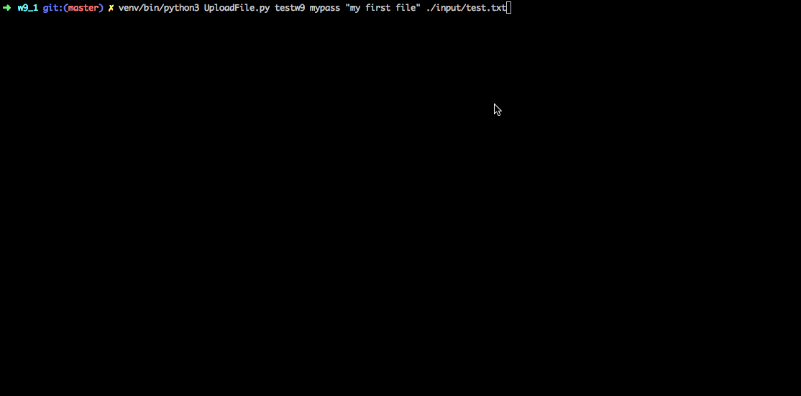
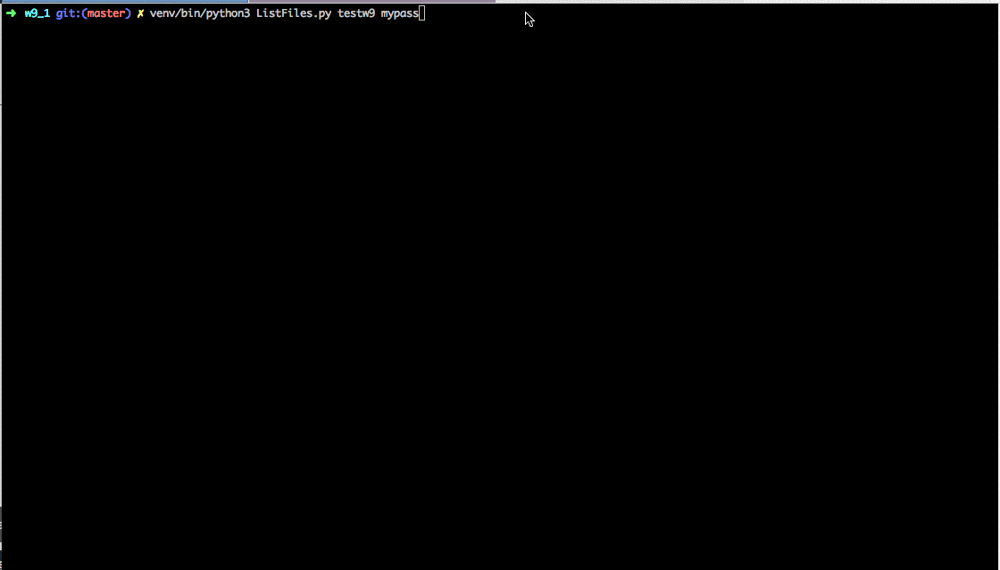

# Introduction 

Using Python and Boto3 this project demonstrates how with create a set of Python  
scripts we can manage a simple S3 storage repository that stores and manages files on a per-user basis.

## Main highlights 

- Create user : using CreateUser.py user can create a S3 Repo user
- Upload file : Once user has been created in repo - user can use UploadFile.py to upload file to S3 Repo
- List file(s): Using ListFiles.py user can list all the files they have uploaded ( if any file present in Repo )

---

- On fist user creation - Repo gets initialized (user bucket/Repo gets created that will stored all user information)
- Passwords are stored using one-way hash in S3 Repo as metadata of file in user bucket 
- During file upload we also show upload progress to see how much file has been uploaded to track long uploads 
- List file uses Python library print table to print data in tabular format 

---

- There is unit test file tests3repo.py that does Unit test on each of the major functions for this project 
- Using file tear_down.py we can cleanup all users and theire files ( admin password is required for this - admin password is stored in s3repomain.py file )

# Files 

| File | Description |
| ---- | --- |
| ├── CreateUser.py | Command line program to create S3 repo user, same can be used to update user info  |
| ├── ListFiles.py | Same as above but to list users file stored in S3 (authentication required) |
| ├── UploadFile.py | Program to upload file to S3 Repo (authentication required)  |
| ├── __init__.py |  |
| ├── tear_down.py | Program to destroy all Repo(s) - (Admin authentication required) |
| └── tests3repo.py | Python Unite test to all functionality of this project |
| ├── README.md | Git readme (this file) |
| ├── input | Directory with sample input file |
| │   ├── test.txt | Sample input file |
| │   └── test2.txt | Sample input file |
| ├── output | Download will save files in this dire |
| │   └── test.txt | Sample output file downloaded |
| ├── s3repo | Main code folder |
| │   ├── helper | Code sub folder with helper file(s) |
| │   │   ├── ProgressPercentage.py | Python code to print file download progress |
| │   │   ├── __init__.py |  |
| │   │   ├── awsGetConnection.py | Code to get AWS connection ; get Boto3 session |
| │   │   ├── logger_setup.py | Python logger setup (file and console) |
| │   │   ├── password_helper.py | Code to create one-way hash for password (use to save and compare password )  |
| │   ├── logs | Logs will be save in this folder  |
| │   │   └── s3repo.log | Log file |
| │   ├── __init__.py |  |
| │   └── s3repomain.py | Main code that has functions such as for : crate S3 Repo,create user,authentication user,upload file,download file,delete user & repo,tear down all |

# Demo 

## Create a user 

## Upload user 

## List file 

## Unite test 

## Tear down 

